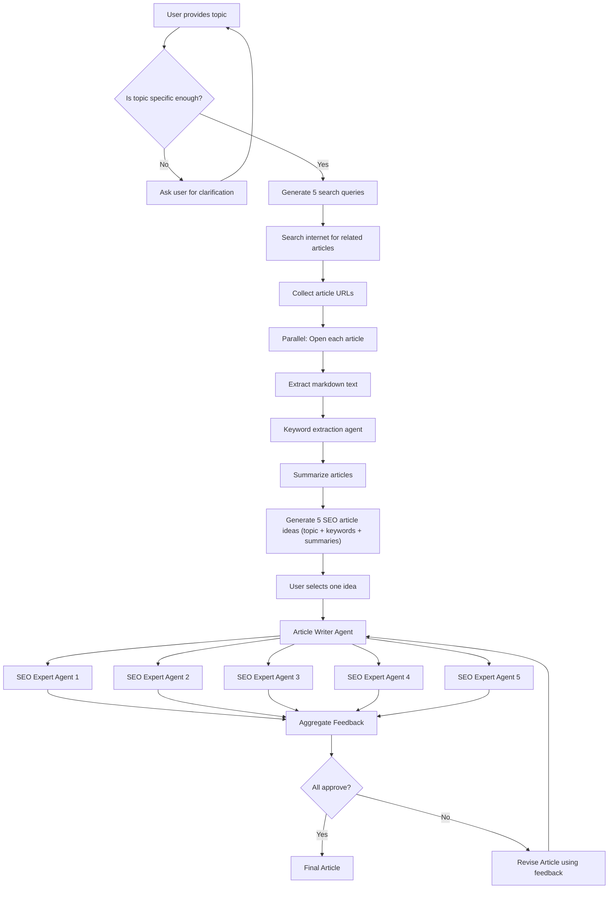

# Research Agent

An agent that analysis given topic. Internally does critique and generates
a blog article for you. It researches internet for similar articles, does
keyword research, undertsands the structure of top ranked articles and keywords an finally
optimizes for content length.

Additionally, Add links. Content without proper internal and external links is one of the main things that scream "AI GENERATED". Think of internal links as your opportunity to show off how well you know your content, and external links as an opportunity to show off how well you know your field.

Optimize other resources. The prompt adds keywords to headers and body text, but you should also optimize any additional elements you would add afterward (e.g., internal links, captions below videos, alt values for images, etc.).

Add citations of relevant, authoritative sources to enhance credibility (if applicable).

## Flow

