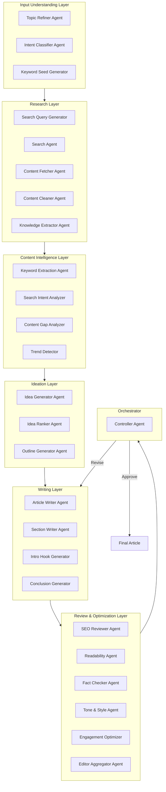

```mermaid
flowchart TD

    %% Input Layer
    subgraph A[Input Understanding Layer]
        A1[Topic Refiner Agent]
        A2[Intent Classifier Agent]
        A3[Keyword Seed Generator]
    end

    %% Research Layer
    subgraph B[Research Layer]
        B1[Search Query Generator]
        B2[Search Agent]
        B3[Content Fetcher Agent]
        B4[Content Cleaner Agent]
        B5[Knowledge Extractor Agent]
    end

    %% Intelligence Layer
    subgraph C[Content Intelligence Layer]
        C1[Keyword Extraction Agent]
        C2[Search Intent Analyzer]
        C3[Content Gap Analyzer]
        C4[Trend Detector]
    end

    %% Ideation Layer
    subgraph D[Ideation Layer]
        D1[Idea Generator Agent]
        D2[Idea Ranker Agent]
        D3[Outline Generator Agent]
    end

    %% Writing Layer
    subgraph E[Writing Layer]
        E1[Article Writer Agent]
        E2[Section Writer Agent]
        E3[Intro Hook Generator]
        E4[Conclusion Generator]
    end

    %% Review Layer
    subgraph F[Review & Optimization Layer]
        F1[SEO Reviewer Agent]
        F2[Readability Agent]
        F3[Fact Checker Agent]
        F4[Tone & Style Agent]
        F5[Engagement Optimizer]
        F6[Editor Aggregator Agent]
    end

    %% Orchestrator
    subgraph G[Orchestrator]
        G1[Controller Agent]
    end

    %% Flow Connections
    A --> B
    B --> C
    C --> D
    D --> E
    E --> F
    F --> G

    %% Feedback Loop
    G -->|Revise| E
    G -->|Approve| H[Final Article]

```
